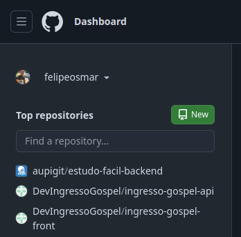
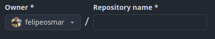
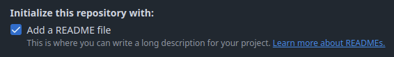
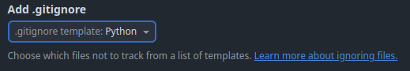
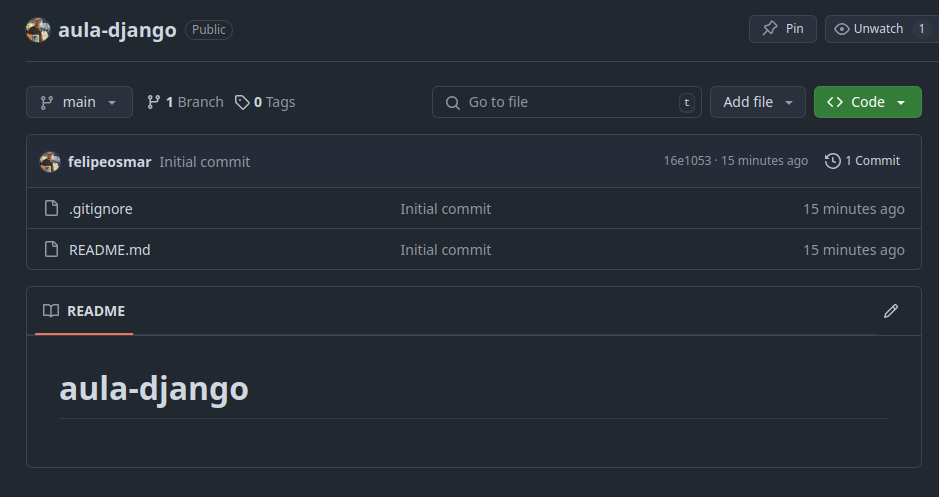
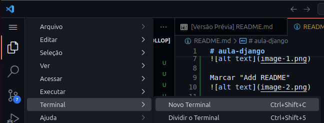
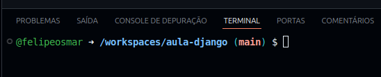

# Oficina django
## Pyenv + Virtualenv + Poetry + Django

O Objetivo deste repositorio é guia-lo na criação de um projeto Django do zero, usando genciador de projetos Poetry, gerenciamento de versões de Python com Pyenv, gerenciamento de versões de bibliotecas com o Virtualenv, e por fim criar uma aplicação web com Django.

## Criar repositorio no github

1. Logar no Github e criar um repositorio: <br>


1. Escolher um nome:<br>


1. Marcar "Add README"<br>


1. Add .gitignore, selecionar Python<br>


1. ao final clicar em "Create repository"<br>


## Abrir repositorio no CodeSpace

1. Acessar o repositorio recem criado<br>
 <br>
* Nesta tela apertar no teclado a tecla "ponto final" "." você será direcioando para o CodeSpace<br>

1. Dentro do CodeSpace, abra um novo Terminal para dar comandos:<br>


1. Será exibido 2 opções, selecionar "Continuar trabalhando no Github CodeSpace", primeiro botão: <br>


1. No topo da tela será exibido 2 opções de servidor, escolher a primeira:<br>


1. Em seguida aparecerá o terminal dentro do servidor na nuvem:<br>



## Instalar o Pyenv
1. Instalar o Pyenv no Linux, copiar o comando e colar no terminal<br>

1. Instalar dependencias:<br>
```
sudo apt update && sudo apt install -y make build-essential libssl-dev zlib1g-dev libbz2-dev libreadline-dev libsqlite3-dev wget curl llvm libncurses5-dev libncursesw5-dev xz-utils tk-dev libffi-dev liblzma-dev python3-openssl git
```
1. Instalar pyenv via scrpit: <br>
```
curl https://pyenv.run | bash
```

1. Adicionar as configurações ao shell:
```
echo 'export PYENV_ROOT="$HOME/.pyenv"' >> ~/.bashrc
echo 'export PATH="$PYENV_ROOT/bin:$PATH"' >> ~/.bashrc
echo 'eval "$(pyenv init --path)"' >> ~/.bashrc
source ~/.bashrc
```

1. Verificar as versões disponiveis ``pyenv install --list`` <br>
para instalar vesão especifica: ``pyenv install 3.11.5`` <br>
Definir a versão global do Python: ``pyenv install 3.11.5`` <br>

## Instalar o Virtualenv

1. Instalar o virtualenv<br>
```
pip install virtualenv
```
2. Verificar instalação<br>
```
virtualenv --version
```

## Instalar Poetry

1. Instalando Poetry via script<br>
```
curl -sSL https://install.python-poetry.org | python3 - 
```
2. Verificar a instalação<br>
```
poetry --version
```
3. Configurar o PATH (se necessário):<br>
```
export PATH="$HOME/.local/bin:$PATH"
```
4. Configurar o Poetry para criar a pasta do venv dentro da pasta do projeto
```
poetry config virtualenvs.in-project true
```

## Criando um ambiente virtual com Poetry

1. Inicializar um novo projeto Poetry:
```
poetry init
```
* Responder as perguntas interativas

## Instalando e Configurando Django

1. Adicionar Django ao projeto:
```
poetry add django
```

1. Criar um novo projeto Django:<br>
**atentar para o ponto no final do comando**
```
poetry run django-admin startproject estacionamento . 
```

## Configuração do Banco de Dados

1. Configurar o banco no ``settings.py``
1. Rodar as migrações iniciais:
```
poetry run python manage.py migrate
```

1. Executando o Servidor Django
```
poetry run python manage.py runserver
```

Acessar http://127.0.0.1:8000/ e verificar se está funcionando

1. Criar o primeiro superusuario
```
poetry run python manage.py createsuperuser
```

responder as perguntas sobre o usuario.

## Criando um Aplicativo Django

é necessario entrar na pasta do projeto:

```cd estacionamento```

1. Criar um novo app chamado base:

```
poetry run python manage.py startapp base
```

1. Registrar o app no INSTALLED_APPS
1. Criar uma view simples e configurar no urls.py


# rodar o projeto pela *segunda* vez:

1. Instalar dependencias:<br>
```
sudo apt update && sudo apt install -y make build-essential libssl-dev zlib1g-dev libbz2-dev libreadline-dev libsqlite3-dev wget curl llvm libncurses5-dev libncursesw5-dev xz-utils tk-dev libffi-dev liblzma-dev python3-openssl git
```
1. Instalar pyenv via scrpit: <br>
```
curl https://pyenv.run | bash
```

1. Adicionar as configurações ao shell:
```
echo 'export PYENV_ROOT="$HOME/.pyenv"' >> ~/.bashrc
echo 'export PATH="$PYENV_ROOT/bin:$PATH"' >> ~/.bashrc
echo 'eval "$(pyenv init --path)"' >> ~/.bashrc
source ~/.bashrc
```
